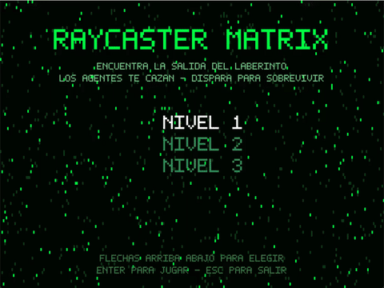
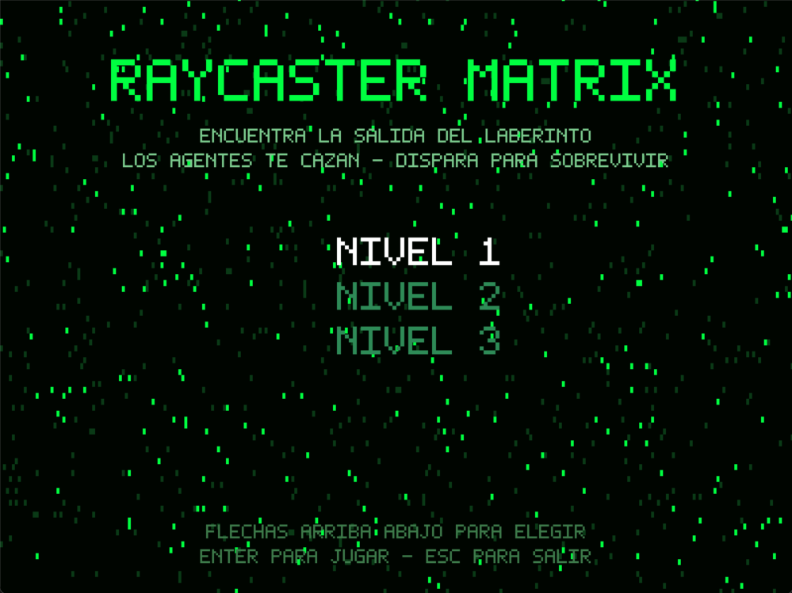
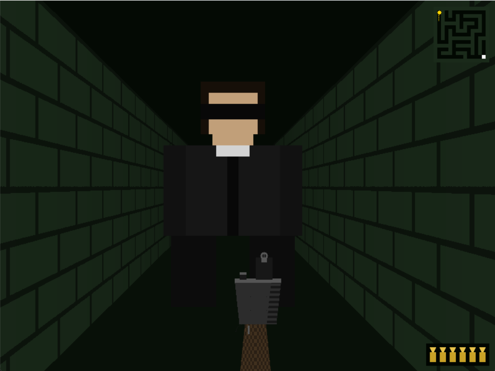
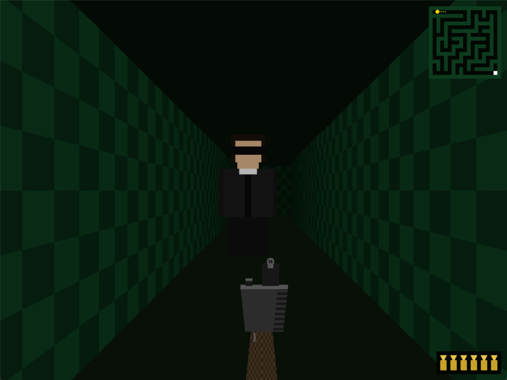
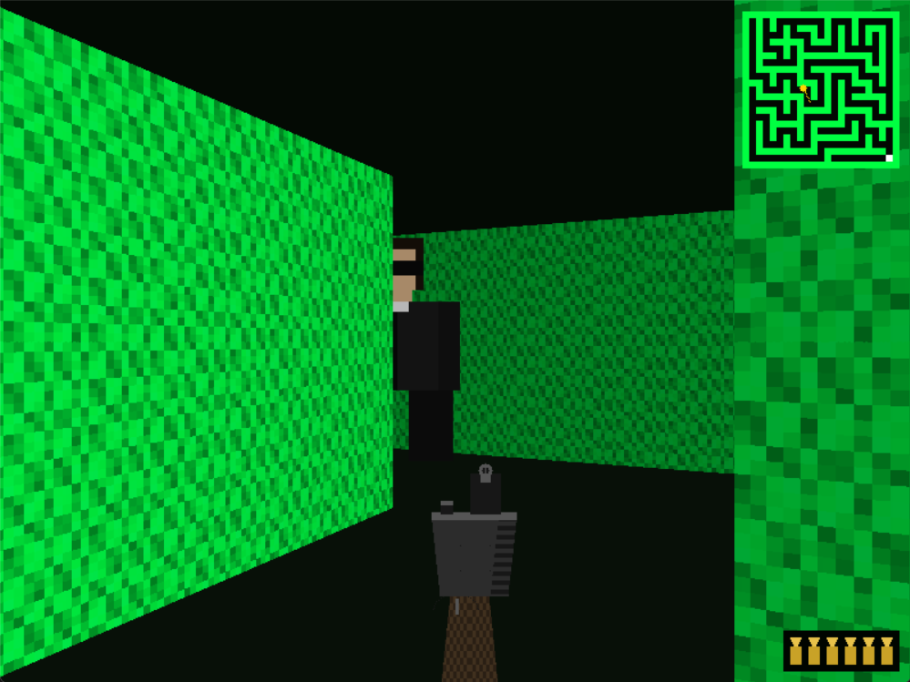
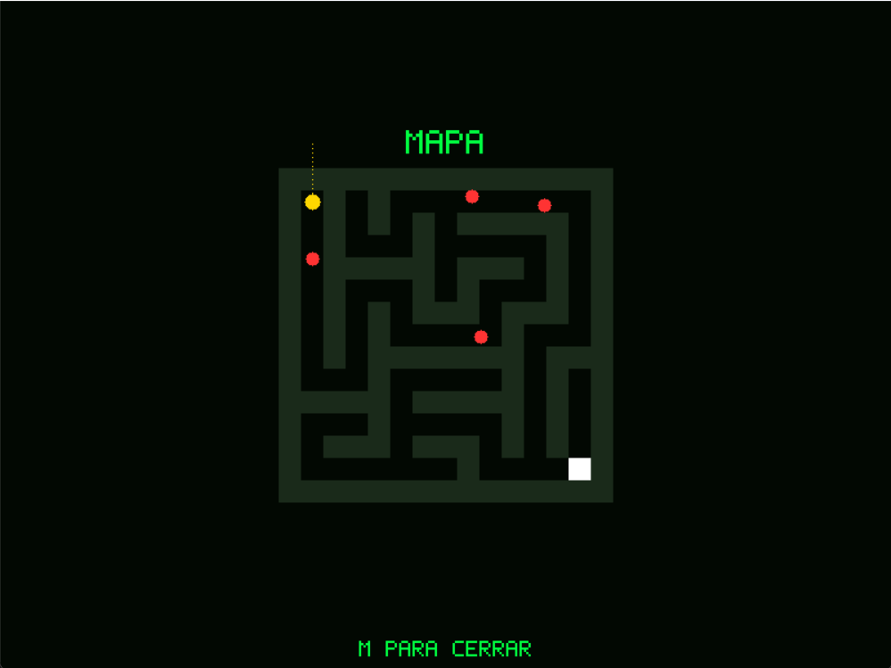
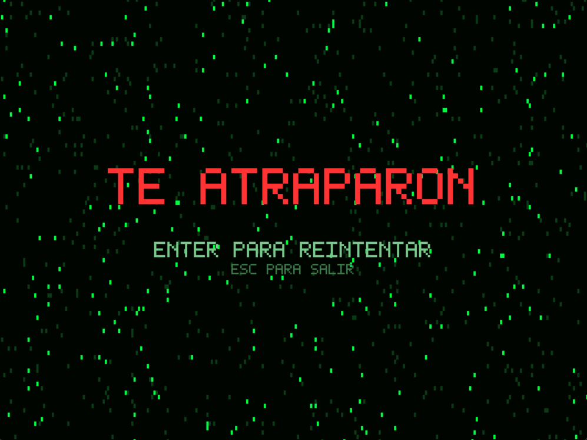
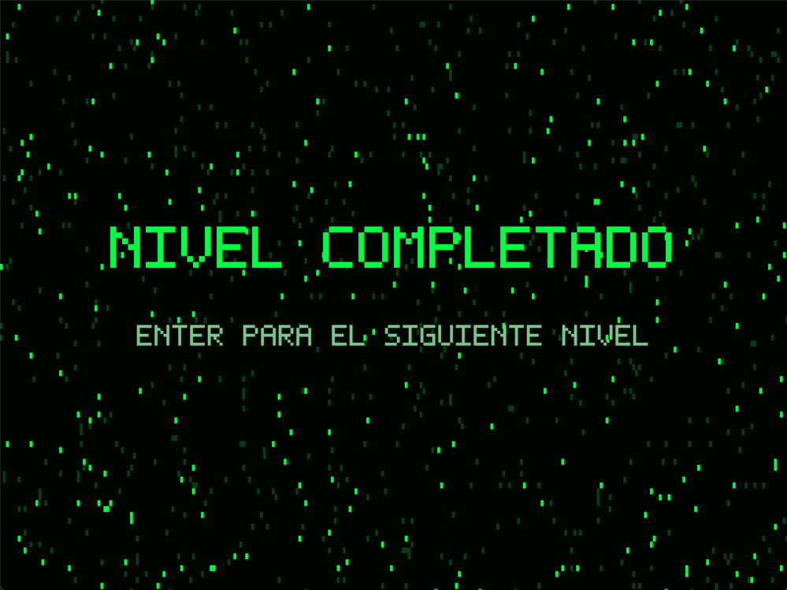

# Raycaster Matrix

Un raycaster estilo Wolfenstein 3D hecho en **Rust puro** (sin motor de juegos, solo `minifb` para la ventana/framebuffer y `rodio` para audio), ambientado en el universo de Matrix. Exploras un laberinto generado proceduralmente buscando la salida mientras te persiguen Agentes, podes dispararles para defenderte pero tenes municion limitada.

## Video de la entrega

> https://youtu.be/5geK5GDFuJI



## Capturas

| | |
|---|---|
|  Bienvenida / seleccion de nivel |  Nivel 1 |
|  Nivel 2 |  Nivel 3 |
|  Mapa completo (tecla M) |  Game Over |
|  Nivel completado | |

## Controles

| Accion | Tecla / Mouse |
|---|---|
| Moverse | W A S D |
| Mirar alrededor | Mover el mouse (rotacion horizontal, sin limite) |
| Disparar | Click izquierdo |
| Recargar | R (o se recarga sola si disparas con el cargador vacio) |
| Ver mapa completo del nivel | M |
| Elegir nivel (menu) | Flecha arriba / Flecha abajo (o W / S) |
| Confirmar / continuar | Enter |
| Salir | Esc |

## Como correrlo

Requiere el toolchain de Rust (cargo).

```
cargo run
```

Para una build optimizada (recomendado si se siente lento):

```
cargo run --release
```

### Musica de fondo (opcional)

El repositorio no incluye musica por derechos de autor. Para tenerla, pone cualquier archivo de audio (mp3, ogg, wav, flac, m4a o aac, el nombre no importa) dentro de assets/audio/ (ver assets/audio/LEEME.txt). Sin ese archivo el juego corre igual, solo que en silencio (no se rompe).

## Que implementa

- Raycasting con DDA y paredes con texturas procedurales (4 tipos distintos, sin usar ninguna imagen externa).
- Camara en primera persona: movimiento WASD mas rotacion horizontal con el mouse, sin limite de giro (recentrado de cursor via Win32).
- Colision contra las paredes (jugador y Agentes deslizan en vez de atravesarlas).
- Minimapa en la esquina superior derecha, sobre la escena 3D, mas un mapa completo del nivel a pantalla completa (tecla M) que muestra la posicion de todos los Agentes activos.
- 3 niveles: laberintos reales generados con el algoritmo recursive backtracker (siempre resolubles, verificado con tests), cada uno mas grande y con mas Agentes (4 / 6 / 8).
- Enemigos con IA: los Agentes patrullan el laberinto al azar y persiguen al jugador en cuanto tienen linea de vision directa (no "saben" donde estas a traves de las paredes). Tienen animacion de caminata (pixel art procedural).
- Disparo: arma en primera persona con retroceso y destello, 6 balas por cargador, recarga con R, HUD de municion en la esquina inferior derecha.
- Pantallas: bienvenida con seleccion de nivel, juego, Game Over, y nivel completado, todas con fuente de pixeles propia y un fondo animado tipo "lluvia de codigo".
- Audio: musica de fondo en loop (archivo del usuario) mas efectos de sonido sintetizados por codigo (disparo, impacto, recarga, Game Over, nivel completado, menu); nada de archivos de sonido externos.

## Arquitectura

| Modulo | Responsabilidad |
|---|---|
| main.rs | Loop principal, maquina de estados (Welcome / Playing / GameOver / Success), input |
| map.rs | Generacion de laberintos, colision, linea de vision |
| player.rs | Camara/posicion del jugador |
| agent.rs | IA de los Agentes (patrulla, persecucion, contacto) |
| raycaster.rs | Render de paredes (DDA + texturas + sombreado) |
| sprite.rs | Proyeccion de sprites (billboard) con z-buffer |
| minimap.rs, bigmap.rs, weapon.rs, hud.rs, screens.rs, text.rs | HUD, mapas, arma, menus, fuente de pixeles |
| audio.rs | Musica y efectos de sonido sintetizados |
| platform.rs | Confinamiento/recentrado del cursor (Win32) |
| rng.rs | Generador pseudoaleatorio propio (sin dependencias externas) |

## Tests

```
cargo test
```

Cubre la generacion de laberintos (siempre conectados y resolubles, verificado con BFS), colisiones, la IA de los Agentes, la proyeccion de sprites y el hit-test de disparo, y el renderizado de texto/pantallas.


## Pendiente

- Soporte para correr en un dispositivo distinto a una computadora tradicional (se evaluara como una exploracion aparte, por ejemplo un port a PS Vita con VitaSDK).
